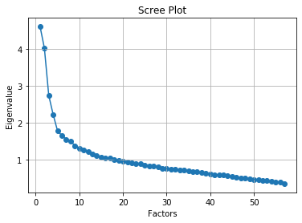

# Personality-prediction
> From the given database `response.csv` Find out the personality traits using this personality prediction project. 

## Let's get started
[](https://www.linkedin.com/in/sagar-darji-7b7011165/)

The system will predict one's personality and their traits through basic survey.This system will help the human resource to select right candidate for desired job profile, which in turn provide expert workforce for the organization.

### Applications in psychology:
Factor analysis has been used in the study of human intelligence and human personality as a method for comparing the outcomes of (hopefully) objective tests and to construct matrices to define correlations between these outcomes, as well as finding the factors for these results. The field of psychology that measures human intelligence using quantitative testing in this way is known as psychometrics (psycho=mental, metrics=measurement). 

### Advantages:
- Offers a much more objective method of testing traits such as intelligence in humans
- Allows for a satisfactory comparison between the results of intelligence tests
- Provides support for theories that would be difficult to prove otherwise

## Algorithm
```python
Refine the Data
Prepare the Data
Choose the Factor
  variable
  correlation matrix
  using any method of factor analysis such as EFA
  Decide no. of factors
  factor loading of factors
  rotation of factor loadings
  provide appropriate no. of factors
  
```

## Now understand and implement the code 
> Import all libraries which we needed to perform this `python code`
```python
#Librerias
import pandas as pd 
import numpy as np
import matplotlib.pyplot as plt
```
Make Dataframe using `Pandas` and shaped it 
```python
#Data
df = pd.read_csv("responses.csv")
df.shape
```
> Out: (1010, 15)

In `response.csv` [1010 rows, 150 rows] 
> Which means this data collected by surveying 1010 individuals and there is 150 types of different prefrence & fields.

MUSIC PREFERENCES (19) 0:19

MOVIE PREFERENCES (12) 19:31

HOBBIES & INTERESTS (32) 31:63

PHOBIAS (10) 63:73

HEALTH HABITS (3) 73:76

PERSONALITY TRAITS, VIEWS ON LIFE & OPINIONS (57) 76:133

SPENDING HABITS (7) 133:140

DEMOGRAPHICS (10 ) 140:150

We will take only: PERSONALITY TRAITS, VIEWS ON LIFE & OPINIONS (57) `76:133`


```python
df = df.iloc[:, 76:133]
df.head(5)
```
> Out:

<table border="1" class="dataframe">
  <thead>
    <tr style="text-align: right;">
      <th></th>
      <th>Daily events</th>
      <th>Prioritising workload</th>
      <th>Writing notes</th>
      <th>Workaholism</th>
      <th>Thinking ahead</th>
      <th>Final judgement</th>
      <th>Reliability</th>
      <th>Keeping promises</th>
      <th>Loss of interest</th>
      <th>Friends versus money</th>
      <th>...</th>
      <th>Happiness in life</th>
      <th>Energy levels</th>
      <th>Small - big dogs</th>
      <th>Personality</th>
      <th>Finding lost valuables</th>
      <th>Getting up</th>
      <th>Interests or hobbies</th>
      <th>Parents' advice</th>
      <th>Questionnaires or polls</th>
      <th>Internet usage</th>
    </tr>
  </thead>
  <tbody>
    <tr>
      <td>0</td>
      <td>2.0</td>
      <td>2.0</td>
      <td>5.0</td>
      <td>4.0</td>
      <td>2.0</td>
      <td>5.0</td>
      <td>4.0</td>
      <td>4.0</td>
      <td>1.0</td>
      <td>3.0</td>
      <td>...</td>
      <td>4.0</td>
      <td>5.0</td>
      <td>1.0</td>
      <td>4.0</td>
      <td>3.0</td>
      <td>2.0</td>
      <td>3.0</td>
      <td>4.0</td>
      <td>3.0</td>
      <td>few hours a day</td>
    </tr>
    <tr>
      <td>1</td>
      <td>3.0</td>
      <td>2.0</td>
      <td>4.0</td>
      <td>5.0</td>
      <td>4.0</td>
      <td>1.0</td>
      <td>4.0</td>
      <td>4.0</td>
      <td>3.0</td>
      <td>4.0</td>
      <td>...</td>
      <td>4.0</td>
      <td>3.0</td>
      <td>5.0</td>
      <td>3.0</td>
      <td>4.0</td>
      <td>5.0</td>
      <td>3.0</td>
      <td>2.0</td>
      <td>3.0</td>
      <td>few hours a day</td>
    </tr>
    <tr>
      <td>2</td>
      <td>1.0</td>
      <td>2.0</td>
      <td>5.0</td>
      <td>3.0</td>
      <td>5.0</td>
      <td>3.0</td>
      <td>4.0</td>
      <td>5.0</td>
      <td>1.0</td>
      <td>5.0</td>
      <td>...</td>
      <td>4.0</td>
      <td>4.0</td>
      <td>3.0</td>
      <td>3.0</td>
      <td>3.0</td>
      <td>4.0</td>
      <td>5.0</td>
      <td>3.0</td>
      <td>1.0</td>
      <td>few hours a day</td>
    </tr>
    <tr>
      <td>3</td>
      <td>4.0</td>
      <td>4.0</td>
      <td>4.0</td>
      <td>5.0</td>
      <td>3.0</td>
      <td>1.0</td>
      <td>3.0</td>
      <td>4.0</td>
      <td>5.0</td>
      <td>2.0</td>
      <td>...</td>
      <td>2.0</td>
      <td>2.0</td>
      <td>1.0</td>
      <td>2.0</td>
      <td>1.0</td>
      <td>1.0</td>
      <td>NaN</td>
      <td>2.0</td>
      <td>4.0</td>
      <td>most of the day</td>
    </tr>
    <tr>
      <td>4</td>
      <td>3.0</td>
      <td>1.0</td>
      <td>2.0</td>
      <td>3.0</td>
      <td>5.0</td>
      <td>5.0</td>
      <td>5.0</td>
      <td>4.0</td>
      <td>2.0</td>
      <td>3.0</td>
      <td>...</td>
      <td>3.0</td>
      <td>5.0</td>
      <td>3.0</td>
      <td>3.0</td>
      <td>2.0</td>
      <td>4.0</td>
      <td>3.0</td>
      <td>3.0</td>
      <td>3.0</td>
      <td>few hours a day</td>
    </tr>
  </tbody>
</table>
<p>5 rows × 57 columns</p>
</div>


# 1. Prepare the Data

```python
#Drop NAs
df = df.dropna()
#...............................................................................................
#Encode categorical data
from sklearn.preprocessing import LabelEncoder

df = df.apply(LabelEncoder().fit_transform)
df
```

`dropna()` method will remove Null value from dataframe.

Why are we encoding the data?
> In order to analys data require all i/p & o/p variable to be nummeric. This means that if our data contains categorical dat, we must encode it to number before you can fit and evalute a model.

There is two type of encoding
1. `Integer encoding`
> each unique label is mapped to an integer.
2. `One hot encoding`
> It refers to splitting the column which contains numerical categorical data to many columns depending on the number of categories present in that column. Each column contains “0” or “1” corresponding to which column it has been placed.

| Before Encoding | After Encoding |
|--------|--------|
| Height | Height |
| Tall | 0 |
| Short | 1 |
| Medium | 2 |
| Medium | 2 |
| Short | 1 |
| Tall | 0 |

Here, We have used `One hot encoding`.

> Out:

<div>
<table border="1" class="dataframe">
  <thead>
    <tr style="text-align: right;">
      <th></th>
      <th>Daily events</th>
      <th>Prioritising workload</th>
      <th>Writing notes</th>
      <th>Workaholism</th>
      <th>Thinking ahead</th>
      <th>Final judgement</th>
      <th>Reliability</th>
      <th>Keeping promises</th>
      <th>Loss of interest</th>
      <th>Friends versus money</th>
      <th>...</th>
      <th>Happiness in life</th>
      <th>Energy levels</th>
      <th>Small - big dogs</th>
      <th>Personality</th>
      <th>Finding lost valuables</th>
      <th>Getting up</th>
      <th>Interests or hobbies</th>
      <th>Parents' advice</th>
      <th>Questionnaires or polls</th>
      <th>Internet usage</th>
    </tr>
  </thead>
  <tbody>
    <tr>
      <td>0</td>
      <td>1</td>
      <td>1</td>
      <td>4</td>
      <td>3</td>
      <td>1</td>
      <td>4</td>
      <td>3</td>
      <td>3</td>
      <td>0</td>
      <td>2</td>
      <td>...</td>
      <td>3</td>
      <td>4</td>
      <td>0</td>
      <td>3</td>
      <td>2</td>
      <td>1</td>
      <td>2</td>
      <td>3</td>
      <td>2</td>
      <td>0</td>
    </tr>
    <tr>
      <td>1</td>
      <td>2</td>
      <td>1</td>
      <td>3</td>
      <td>4</td>
      <td>3</td>
      <td>0</td>
      <td>3</td>
      <td>3</td>
      <td>2</td>
      <td>3</td>
      <td>...</td>
      <td>3</td>
      <td>2</td>
      <td>4</td>
      <td>2</td>
      <td>3</td>
      <td>4</td>
      <td>2</td>
      <td>1</td>
      <td>2</td>
      <td>0</td>
    </tr>
    <tr>
      <td>2</td>
      <td>0</td>
      <td>1</td>
      <td>4</td>
      <td>2</td>
      <td>4</td>
      <td>2</td>
      <td>3</td>
      <td>4</td>
      <td>0</td>
      <td>4</td>
      <td>...</td>
      <td>3</td>
      <td>3</td>
      <td>2</td>
      <td>2</td>
      <td>2</td>
      <td>3</td>
      <td>4</td>
      <td>2</td>
      <td>0</td>
      <td>0</td>
    </tr>
    <tr>
      <td>4</td>
      <td>2</td>
      <td>0</td>
      <td>1</td>
      <td>2</td>
      <td>4</td>
      <td>4</td>
      <td>4</td>
      <td>3</td>
      <td>1</td>
      <td>2</td>
      <td>...</td>
      <td>2</td>
      <td>4</td>
      <td>2</td>
      <td>2</td>
      <td>1</td>
      <td>3</td>
      <td>2</td>
      <td>2</td>
      <td>2</td>
      <td>0</td>
    </tr>
    <tr>
      <td>5</td>
      <td>1</td>
      <td>1</td>
      <td>2</td>
      <td>2</td>
      <td>2</td>
      <td>0</td>
      <td>2</td>
      <td>3</td>
      <td>2</td>
      <td>1</td>
      <td>...</td>
      <td>2</td>
      <td>3</td>
      <td>3</td>
      <td>2</td>
      <td>2</td>
      <td>2</td>
      <td>4</td>
      <td>2</td>
      <td>3</td>
      <td>0</td>
    </tr>
    <tr>
      <td>...</td>
      <td>...</td>
      <td>...</td>
      <td>...</td>
      <td>...</td>
      <td>...</td>
      <td>...</td>
      <td>...</td>
      <td>...</td>
      <td>...</td>
      <td>...</td>
      <td>...</td>
      <td>...</td>
      <td>...</td>
      <td>...</td>
      <td>...</td>
      <td>...</td>
      <td>...</td>
      <td>...</td>
      <td>...</td>
      <td>...</td>
      <td>...</td>
    </tr>
    <tr>
      <td>1005</td>
      <td>2</td>
      <td>1</td>
      <td>0</td>
      <td>3</td>
      <td>1</td>
      <td>2</td>
      <td>2</td>
      <td>2</td>
      <td>3</td>
      <td>3</td>
      <td>...</td>
      <td>3</td>
      <td>2</td>
      <td>2</td>
      <td>2</td>
      <td>3</td>
      <td>4</td>
      <td>3</td>
      <td>3</td>
      <td>2</td>
      <td>0</td>
    </tr>
    <tr>
      <td>1006</td>
      <td>0</td>
      <td>2</td>
      <td>0</td>
      <td>4</td>
      <td>4</td>
      <td>4</td>
      <td>4</td>
      <td>3</td>
      <td>0</td>
      <td>1</td>
      <td>...</td>
      <td>3</td>
      <td>3</td>
      <td>2</td>
      <td>4</td>
      <td>2</td>
      <td>0</td>
      <td>2</td>
      <td>3</td>
      <td>2</td>
      <td>1</td>
    </tr>
    <tr>
      <td>1007</td>
      <td>2</td>
      <td>0</td>
      <td>0</td>
      <td>0</td>
      <td>3</td>
      <td>0</td>
      <td>2</td>
      <td>4</td>
      <td>0</td>
      <td>3</td>
      <td>...</td>
      <td>2</td>
      <td>0</td>
      <td>2</td>
      <td>1</td>
      <td>2</td>
      <td>4</td>
      <td>0</td>
      <td>3</td>
      <td>4</td>
      <td>2</td>
    </tr>
    <tr>
      <td>1008</td>
      <td>2</td>
      <td>0</td>
      <td>4</td>
      <td>0</td>
      <td>2</td>
      <td>3</td>
      <td>3</td>
      <td>3</td>
      <td>4</td>
      <td>2</td>
      <td>...</td>
      <td>2</td>
      <td>1</td>
      <td>1</td>
      <td>3</td>
      <td>0</td>
      <td>4</td>
      <td>2</td>
      <td>2</td>
      <td>2</td>
      <td>2</td>
    </tr>
    <tr>
      <td>1009</td>
      <td>2</td>
      <td>4</td>
      <td>3</td>
      <td>4</td>
      <td>3</td>
      <td>2</td>
      <td>4</td>
      <td>4</td>
      <td>2</td>
      <td>3</td>
      <td>...</td>
      <td>3</td>
      <td>1</td>
      <td>2</td>
      <td>3</td>
      <td>0</td>
      <td>1</td>
      <td>1</td>
      <td>2</td>
      <td>4</td>
      <td>0</td>
    </tr>
  </tbody>
</table>
<p>864 rows × 57 columns</p>
</div>

## 2. Choose the Factors

```python
pip install factor_analyzer 
```
    Requirement already satisfied: factor_analyzer in c:\users\dell\anaconda3\lib\site-packages (0.3.2)
    Requirement already satisfied: pandas in c:\users\dell\anaconda3\lib\site-packages (from factor_analyzer) (0.25.1)
    Requirement already satisfied: scipy in c:\users\dell\anaconda3\lib\site-packages (from factor_analyzer) (1.3.1)
    Requirement already satisfied: numpy in c:\users\dell\anaconda3\lib\site-packages (from factor_analyzer) (1.16.5)
    Requirement already satisfied: scikit-learn in c:\users\dell\anaconda3\lib\site-packages (from factor_analyzer) (0.21.3)
    Requirement already satisfied: pytz>=2017.2 in c:\users\dell\anaconda3\lib\site-packages (from pandas->factor_analyzer) (2019.3)
    Requirement already satisfied: python-dateutil>=2.6.1 in c:\users\dell\anaconda3\lib\site-packages (from pandas->factor_analyzer) (2.8.0)
    Requirement already satisfied: joblib>=0.11 in c:\users\dell\anaconda3\lib\site-packages (from scikit-learn->factor_analyzer) (0.13.2)
    Requirement already satisfied: six>=1.5 in c:\users\dell\anaconda3\lib\site-packages (from python-dateutil>=2.6.1->pandas->factor_analyzer) (1.12.0)
    Note: you may need to restart the kernel to use updated packages.

`Factor Analyzer`
> Reduce large no. variables into fewer no. of factors. This is a python module to perform exploratory and factor analysis with several optional rotations. It also includes a class to perform confirmatory factor analysis (CFA), with curtain predefined techniques. 

What is Factor Roatation
> minimize the complexity of the factor loadings to make the structure simpler to interpret.

There is two type of rotation
1. Orthogonal rotation
> constrain the factors to be uncorrelated. Althogh often favored, In many cases it is unrealistic to expect the factor to be uncorrelated and forcing then to be uncorrelated make it less likely that the rotation produces a solution with simple structure.
  Method:
  1. `varimax`
     > it maximizes the sum of the variances of the squared loadings and makes the structure simpler.
     Mathematical equation of `varimax`
      
  1. `quatimax`
  1. `equimax`
4. Oblique rotation
> permit the factors to be correlated with one another often produces solution with a simpler structure.

Here, Our data is uncorrelated so we have used Orthogonal's `varimax` rotation method.
 
Now, We determine no. of factor using Scree plot 
> we can use also eigenvalue to determine no. of factor but that is more complex and by Scree plot its is to find.

```python
#Try the model with all the variables 
from factor_analyzer import FactorAnalyzer         # pip install factor_analyzer 
fa = FactorAnalyzer(rotation="varimax")
fa.fit(df) 

# Check Eigenvalues
ev, v = fa.get_eigenvalues()
ev

# Create scree plot using matplotlib
plt.scatter(range(1,df.shape[1]+1),ev)
plt.plot(range(1,df.shape[1]+1),ev)
plt.title('Scree Plot')
plt.xlabel('Factors')
plt.ylabel('Eigenvalue')
plt.grid()
plt.show()
```
> Out:



How we find no. of factor?
>  A scree plot shows the eigenvalues on the y-axis and the number of factors on the x-axis. It always displays a downward curve.The point where the slope of the curve is clearly leveling off (the “elbow) indicates the number of factors that should be generated by the analysis.

As you can see the most usefull factors for explain the data are between 5-6 until falling significantly.

We will fit the model with 5 Factors:

```python
#Factor analysis with 5 fators
fa = FactorAnalyzer(5, rotation="varimax")
fa.fit(df)
AF = fa.loadings_
AF = pd.DataFrame(AF)
AF.index = df.columns
AF
```
> Out:
<div>
<table border="1" class="dataframe">
  <thead>
    <tr style="text-align: right;">
      <th></th>
      <th>0</th>
      <th>1</th>
      <th>2</th>
      <th>3</th>
      <th>4</th>
    </tr>
  </thead>
  <tbody>
    <tr>
      <td>Daily events</td>
      <td>0.250416</td>
      <td>0.058953</td>
      <td>0.206877</td>
      <td>0.026094</td>
      <td>0.028915</td>
    </tr>
    <tr>
      <td>Prioritising workload</td>
      <td>-0.012803</td>
      <td>-0.150045</td>
      <td>0.555946</td>
      <td>0.078913</td>
      <td>0.128156</td>
    </tr>
    <tr>
      <td>Writing notes</td>
      <td>-0.006039</td>
      <td>-0.015927</td>
      <td>0.420849</td>
      <td>0.225307</td>
      <td>0.261380</td>
    </tr>
    <tr>
      <td>Workaholism</td>
      <td>0.069524</td>
      <td>0.029275</td>
      <td>0.527082</td>
      <td>0.088573</td>
      <td>0.032979</td>
    </tr>
    <tr>
      <td>Thinking ahead</td>
      <td>0.023475</td>
      <td>0.127909</td>
      <td>0.530457</td>
      <td>0.035213</td>
      <td>0.055426</td>
    </tr>
    <tr>
      <td>Final judgement</td>
      <td>0.046188</td>
      <td>0.112493</td>
      <td>0.119861</td>
      <td>0.381338</td>
      <td>-0.039756</td>
    </tr>
    <tr>
      <td>Reliability</td>
      <td>0.061028</td>
      <td>-0.102481</td>
      <td>0.539373</td>
      <td>0.073534</td>
      <td>-0.003491</td>
    </tr>
    <tr>
      <td>Keeping promises</td>
      <td>0.053358</td>
      <td>-0.034661</td>
      <td>0.420538</td>
      <td>0.121450</td>
      <td>-0.033511</td>
    </tr>
    <tr>
      <td>Loss of interest</td>
      <td>0.273777</td>
      <td>0.226286</td>
      <td>0.003524</td>
      <td>-0.149262</td>
      <td>0.101882</td>
    </tr>
    <tr>
      <td>Friends versus money</td>
      <td>0.021279</td>
      <td>-0.111839</td>
      <td>0.022026</td>
      <td>0.381357</td>
      <td>-0.045824</td>
    </tr>
    <tr>
      <td>Funniness</td>
      <td>0.312861</td>
      <td>0.131400</td>
      <td>-0.043014</td>
      <td>-0.018258</td>
      <td>-0.026083</td>
    </tr>
    <tr>
      <td>Fake</td>
      <td>0.091188</td>
      <td>0.469616</td>
      <td>-0.024535</td>
      <td>-0.191798</td>
      <td>0.019356</td>
    </tr>
    <tr>
      <td>Criminal damage</td>
      <td>0.154868</td>
      <td>0.177732</td>
      <td>-0.112659</td>
      <td>-0.240721</td>
      <td>0.266761</td>
    </tr>
    <tr>
      <td>Decision making</td>
      <td>-0.287128</td>
      <td>0.102033</td>
      <td>0.267415</td>
      <td>0.129336</td>
      <td>0.158694</td>
    </tr>
    <tr>
      <td>Elections</td>
      <td>0.074306</td>
      <td>-0.015585</td>
      <td>0.222003</td>
      <td>0.131404</td>
      <td>-0.083563</td>
    </tr>
    <tr>
      <td>Self-criticism</td>
      <td>-0.016858</td>
      <td>0.398420</td>
      <td>0.229116</td>
      <td>0.114144</td>
      <td>0.069707</td>
    </tr>
    <tr>
      <td>Judgment calls</td>
      <td>0.182082</td>
      <td>-0.010461</td>
      <td>0.102263</td>
      <td>0.035675</td>
      <td>0.086474</td>
    </tr>
    <tr>
      <td>Hypochondria</td>
      <td>-0.040254</td>
      <td>0.258913</td>
      <td>-0.034874</td>
      <td>0.042981</td>
      <td>0.213548</td>
    </tr>
    <tr>
      <td>Empathy</td>
      <td>-0.050152</td>
      <td>-0.073697</td>
      <td>0.059441</td>
      <td>0.324982</td>
      <td>0.133754</td>
    </tr>
    <tr>
      <td>Eating to survive</td>
      <td>-0.010608</td>
      <td>0.183045</td>
      <td>0.003261</td>
      <td>-0.015131</td>
      <td>-0.018874</td>
    </tr>
    <tr>
      <td>Giving</td>
      <td>0.082276</td>
      <td>-0.154549</td>
      <td>0.112481</td>
      <td>0.376723</td>
      <td>0.234000</td>
    </tr>
    <tr>
      <td>Compassion to animals</td>
      <td>-0.083505</td>
      <td>-0.002767</td>
      <td>-0.010424</td>
      <td>0.262183</td>
      <td>0.192734</td>
    </tr>
    <tr>
      <td>Borrowed stuff</td>
      <td>-0.097017</td>
      <td>-0.023047</td>
      <td>0.323253</td>
      <td>0.171017</td>
      <td>0.071189</td>
    </tr>
    <tr>
      <td>Loneliness</td>
      <td>-0.199197</td>
      <td>0.542350</td>
      <td>-0.019272</td>
      <td>0.045942</td>
      <td>0.190369</td>
    </tr>
    <tr>
      <td>Cheating in school</td>
      <td>0.216223</td>
      <td>-0.063183</td>
      <td>-0.384634</td>
      <td>-0.083940</td>
      <td>0.208210</td>
    </tr>
    <tr>
      <td>Health</td>
      <td>-0.012267</td>
      <td>0.027867</td>
      <td>0.131645</td>
      <td>0.184296</td>
      <td>0.437826</td>
    </tr>
    <tr>
      <td>Changing the past</td>
      <td>-0.016622</td>
      <td>0.482307</td>
      <td>-0.161320</td>
      <td>0.073843</td>
      <td>0.159231</td>
    </tr>
    <tr>
      <td>God</td>
      <td>0.047894</td>
      <td>0.032281</td>
      <td>0.027136</td>
      <td>0.453873</td>
      <td>-0.025963</td>
    </tr>
    <tr>
      <td>Dreams</td>
      <td>0.207076</td>
      <td>-0.187723</td>
      <td>0.078634</td>
      <td>0.037709</td>
      <td>-0.124853</td>
    </tr>
    <tr>
      <td>Charity</td>
      <td>0.163161</td>
      <td>0.116834</td>
      <td>0.156898</td>
      <td>0.354953</td>
      <td>-0.067795</td>
    </tr>
    <tr>
      <td>Number of friends</td>
      <td>0.514994</td>
      <td>-0.321738</td>
      <td>-0.086711</td>
      <td>0.241070</td>
      <td>-0.006859</td>
    </tr>
    <tr>
      <td>Punctuality</td>
      <td>0.004662</td>
      <td>0.090531</td>
      <td>-0.143569</td>
      <td>0.069648</td>
      <td>0.078111</td>
    </tr>
    <tr>
      <td>Lying</td>
      <td>-0.095933</td>
      <td>-0.193370</td>
      <td>0.001775</td>
      <td>0.138092</td>
      <td>0.006950</td>
    </tr>
    <tr>
      <td>Waiting</td>
      <td>0.032019</td>
      <td>-0.067715</td>
      <td>-0.000820</td>
      <td>0.075966</td>
      <td>-0.329606</td>
    </tr>
    <tr>
      <td>New environment</td>
      <td>0.470076</td>
      <td>-0.129745</td>
      <td>-0.058912</td>
      <td>0.005400</td>
      <td>-0.230743</td>
    </tr>
    <tr>
      <td>Mood swings</td>
      <td>-0.086477</td>
      <td>0.353226</td>
      <td>-0.041005</td>
      <td>0.031490</td>
      <td>0.404388</td>
    </tr>
    <tr>
      <td>Appearence and gestures</td>
      <td>0.227246</td>
      <td>-0.004762</td>
      <td>0.105894</td>
      <td>0.068825</td>
      <td>0.303119</td>
    </tr>
    <tr>
      <td>Socializing</td>
      <td>0.537811</td>
      <td>-0.096245</td>
      <td>-0.048127</td>
      <td>0.135323</td>
      <td>-0.039204</td>
    </tr>
    <tr>
      <td>Achievements</td>
      <td>0.252835</td>
      <td>0.048658</td>
      <td>-0.042799</td>
      <td>-0.082401</td>
      <td>0.111902</td>
    </tr>
    <tr>
      <td>Responding to a serious letter</td>
      <td>-0.126985</td>
      <td>0.087976</td>
      <td>-0.026876</td>
      <td>0.022940</td>
      <td>0.013346</td>
    </tr>
    <tr>
      <td>Children</td>
      <td>0.079877</td>
      <td>-0.134254</td>
      <td>0.033040</td>
      <td>0.440103</td>
      <td>0.075663</td>
    </tr>
    <tr>
      <td>Assertiveness</td>
      <td>0.353462</td>
      <td>-0.094372</td>
      <td>0.002509</td>
      <td>-0.067185</td>
      <td>0.044117</td>
    </tr>
    <tr>
      <td>Getting angry</td>
      <td>0.051167</td>
      <td>0.176922</td>
      <td>-0.086069</td>
      <td>-0.070837</td>
      <td>0.532025</td>
    </tr>
    <tr>
      <td>Knowing the right people</td>
      <td>0.478657</td>
      <td>0.022868</td>
      <td>0.113503</td>
      <td>-0.045359</td>
      <td>0.227230</td>
    </tr>
    <tr>
      <td>Public speaking</td>
      <td>-0.385674</td>
      <td>0.104662</td>
      <td>0.069712</td>
      <td>0.030447</td>
      <td>0.190834</td>
    </tr>
    <tr>
      <td>Unpopularity</td>
      <td>-0.082146</td>
      <td>0.229228</td>
      <td>0.079173</td>
      <td>0.241031</td>
      <td>-0.031212</td>
    </tr>
    <tr>
      <td>Life struggles</td>
      <td>-0.226293</td>
      <td>0.057892</td>
      <td>-0.059615</td>
      <td>0.384875</td>
      <td>0.392060</td>
    </tr>
    <tr>
      <td>Happiness in life</td>
      <td>0.288585</td>
      <td>-0.541050</td>
      <td>0.158473</td>
      <td>0.051235</td>
      <td>-0.064525</td>
    </tr>
    <tr>
      <td>Energy levels</td>
      <td>0.499978</td>
      <td>-0.478860</td>
      <td>0.037918</td>
      <td>0.122773</td>
      <td>-0.025001</td>
    </tr>
    <tr>
      <td>Small - big dogs</td>
      <td>0.206696</td>
      <td>0.040211</td>
      <td>-0.143225</td>
      <td>-0.203991</td>
      <td>-0.131298</td>
    </tr>
    <tr>
      <td>Personality</td>
      <td>0.259646</td>
      <td>-0.393197</td>
      <td>0.064236</td>
      <td>0.049013</td>
      <td>-0.056988</td>
    </tr>
    <tr>
      <td>Finding lost valuables</td>
      <td>-0.127907</td>
      <td>-0.011367</td>
      <td>0.163354</td>
      <td>0.391951</td>
      <td>-0.101749</td>
    </tr>
    <tr>
      <td>Getting up</td>
      <td>0.012217</td>
      <td>0.150551</td>
      <td>-0.312297</td>
      <td>0.082580</td>
      <td>0.121198</td>
    </tr>
    <tr>
      <td>Interests or hobbies</td>
      <td>0.465627</td>
      <td>-0.253289</td>
      <td>0.065015</td>
      <td>0.144827</td>
      <td>-0.078694</td>
    </tr>
    <tr>
      <td>Parents' advice</td>
      <td>0.022594</td>
      <td>-0.032871</td>
      <td>0.243628</td>
      <td>0.282252</td>
      <td>0.113225</td>
    </tr>
    <tr>
      <td>Questionnaires or polls</td>
      <td>-0.045177</td>
      <td>0.114865</td>
      <td>0.154309</td>
      <td>0.188501</td>
      <td>-0.032532</td>
    </tr>
    <tr>
      <td>Internet usage</td>
      <td>-0.046077</td>
      <td>0.075435</td>
      <td>-0.007799</td>
      <td>-0.081575</td>
      <td>0.048144</td>
    </tr>
  </tbody>
</table>
</div>

```python
#Get Top variables for each Factor 
F = AF.unstack()
F = pd.DataFrame(F).reset_index()
F = F.sort_values(['level_0',0], ascending=False).groupby('level_0').head(5)    # Top 5 
F = F.sort_values(by="level_0")
F.columns=["FACTOR","Variable","Varianza_Explica"]
F = F.reset_index().drop(["index"],axis=1)
F
```
> Out:
<div>
<table border="1" class="dataframe">
  <thead>
    <tr style="text-align: right;">
      <th></th>
      <th>FACTOR</th>
      <th>Variable</th>
      <th>Varianza_Explica</th>
    </tr>
  </thead>
  <tbody>
    <tr>
      <td>0</td>
      <td>0</td>
      <td>New environment</td>
      <td>0.470076</td>
    </tr>
    <tr>
      <td>1</td>
      <td>0</td>
      <td>Energy levels</td>
      <td>0.499978</td>
    </tr>
    <tr>
      <td>2</td>
      <td>0</td>
      <td>Number of friends</td>
      <td>0.514994</td>
    </tr>
    <tr>
      <td>3</td>
      <td>0</td>
      <td>Socializing</td>
      <td>0.537811</td>
    </tr>
    <tr>
      <td>4</td>
      <td>0</td>
      <td>Knowing the right people</td>
      <td>0.478657</td>
    </tr>
    <tr>
      <td>5</td>
      <td>1</td>
      <td>Mood swings</td>
      <td>0.353226</td>
    </tr>
    <tr>
      <td>6</td>
      <td>1</td>
      <td>Self-criticism</td>
      <td>0.398420</td>
    </tr>
    <tr>
      <td>7</td>
      <td>1</td>
      <td>Fake</td>
      <td>0.469616</td>
    </tr>
    <tr>
      <td>8</td>
      <td>1</td>
      <td>Changing the past</td>
      <td>0.482307</td>
    </tr>
    <tr>
      <td>9</td>
      <td>1</td>
      <td>Loneliness</td>
      <td>0.542350</td>
    </tr>
    <tr>
      <td>10</td>
      <td>2</td>
      <td>Writing notes</td>
      <td>0.420849</td>
    </tr>
    <tr>
      <td>11</td>
      <td>2</td>
      <td>Workaholism</td>
      <td>0.527082</td>
    </tr>
    <tr>
      <td>12</td>
      <td>2</td>
      <td>Thinking ahead</td>
      <td>0.530457</td>
    </tr>
    <tr>
      <td>13</td>
      <td>2</td>
      <td>Prioritising workload</td>
      <td>0.555946</td>
    </tr>
    <tr>
      <td>14</td>
      <td>2</td>
      <td>Reliability</td>
      <td>0.539373</td>
    </tr>
    <tr>
      <td>15</td>
      <td>3</td>
      <td>Friends versus money</td>
      <td>0.381357</td>
    </tr>
    <tr>
      <td>16</td>
      <td>3</td>
      <td>Life struggles</td>
      <td>0.384875</td>
    </tr>
    <tr>
      <td>17</td>
      <td>3</td>
      <td>Finding lost valuables</td>
      <td>0.391951</td>
    </tr>
    <tr>
      <td>18</td>
      <td>3</td>
      <td>Children</td>
      <td>0.440103</td>
    </tr>
    <tr>
      <td>19</td>
      <td>3</td>
      <td>God</td>
      <td>0.453873</td>
    </tr>
    <tr>
      <td>20</td>
      <td>4</td>
      <td>Appearence and gestures</td>
      <td>0.303119</td>
    </tr>
    <tr>
      <td>21</td>
      <td>4</td>
      <td>Life struggles</td>
      <td>0.392060</td>
    </tr>
    <tr>
      <td>22</td>
      <td>4</td>
      <td>Mood swings</td>
      <td>0.404388</td>
    </tr>
    <tr>
      <td>23</td>
      <td>4</td>
      <td>Health</td>
      <td>0.437826</td>
    </tr>
    <tr>
      <td>24</td>
      <td>4</td>
      <td>Getting angry</td>
      <td>0.532025</td>
    </tr>
  </tbody>
</table>
</div>


```python
#Show the Top for each Factor 
F = F.pivot(columns='FACTOR')["Variable"]
F.apply(lambda x: pd.Series(x.dropna().to_numpy()))
```
> Out:
<div>
<table border="1" class="dataframe">
  <thead>
    <tr style="text-align: right;">
      <th>FACTOR</th>
      <th>0</th>
      <th>1</th>
      <th>2</th>
      <th>3</th>
      <th>4</th>
    </tr>
  </thead>
  <tbody>
    <tr>
      <td>0</td>
      <td>New environment</td>
      <td>Mood swings</td>
      <td>Writing notes</td>
      <td>Friends versus money</td>
      <td>Appearence and gestures</td>
    </tr>
    <tr>
      <td>1</td>
      <td>Energy levels</td>
      <td>Self-criticism</td>
      <td>Workaholism</td>
      <td>Life struggles</td>
      <td>Life struggles</td>
    </tr>
    <tr>
      <td>2</td>
      <td>Number of friends</td>
      <td>Fake</td>
      <td>Thinking ahead</td>
      <td>Finding lost valuables</td>
      <td>Mood swings</td>
    </tr>
    <tr>
      <td>3</td>
      <td>Socializing</td>
      <td>Changing the past</td>
      <td>Prioritising workload</td>
      <td>Children</td>
      <td>Health</td>
    </tr>
    <tr>
      <td>4</td>
      <td>Knowing the right people</td>
      <td>Loneliness</td>
      <td>Reliability</td>
      <td>God</td>
      <td>Getting angry</td>
    </tr>
  </tbody>
</table>
</div>

---

FACTOR 1: Energy levels, Number of friends, Socializing...

Could be: Extraversion

---

FACTOR 2: Self-ciricism, Fake, Loneliness...

Looks very similar to "Neuroticism"

---

Factor 3: Thinking ahead, Prioritising workload...

very similar to "Conscientiousness"

---

Factor 4: Children, God, Finding lost valuables

This factor could be something like "religious" or "conservative", maybe have lowest scores of a "Openness" in Big Five model.

---

Factor 5: Appearence and gestures, Mood swings

Mmmm it could be "Agreeableness". What do you think it could be represent?

---

## Conclusion
The first three Factors are very clear: Extraversion, Neuroticism and Conscientiousness. The other two not to much. Anyway is a very interesting approximation 

Maybe doing first a PCA for remove hight correlate variables like "God" and "Final judgement"could help.

What do you think?

# Thank you      
                                       
> I appreciate especially your `Heart`
